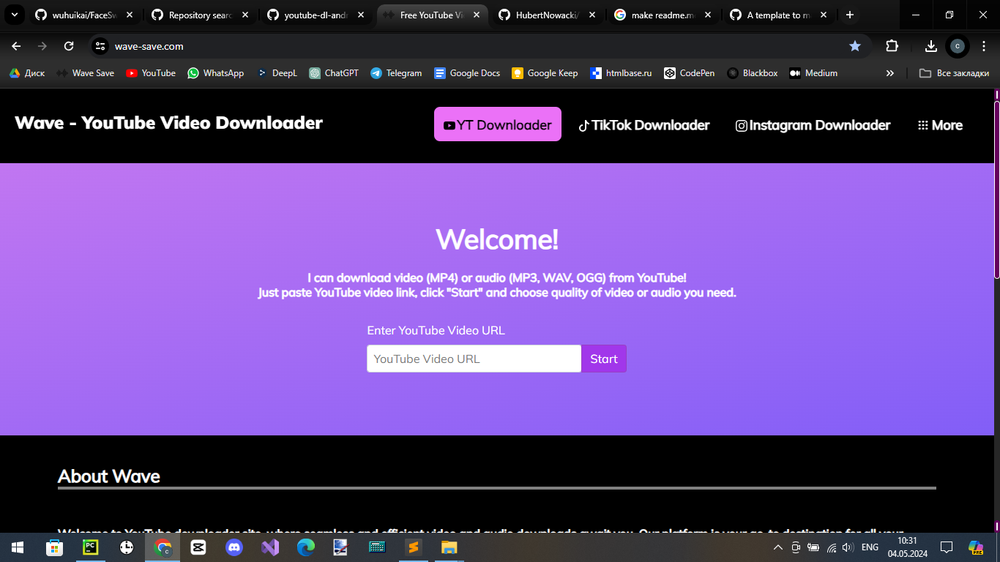
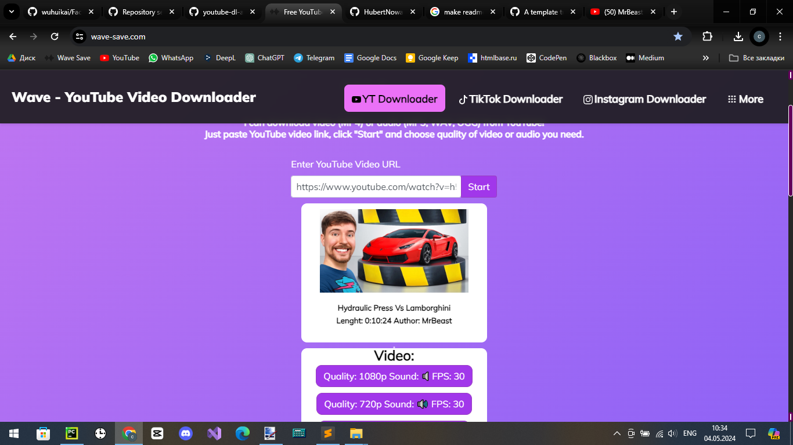

# Wave-Save - YouTube Downloader site 

Hi! This is my own YouTube Downloader site, what I coded myself to help you with downloading videos from YT and other platforms.

Link: https://www.wave-save.com/
## Frameworks and libraries

- Language: Python
- Flask
- pytube
- yt-dlp
- instaloader
- moviepy

## Features

- Download videos from Youtube, TikTok
- Download post images from Instagram
- Download videos fast
- Download videos in 4K, 1080p

## Screenshots

 
